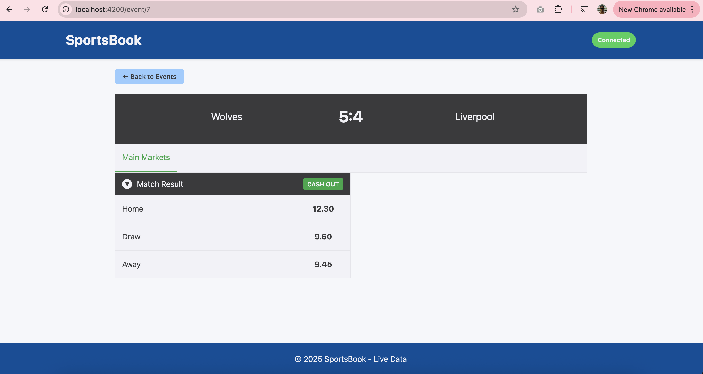
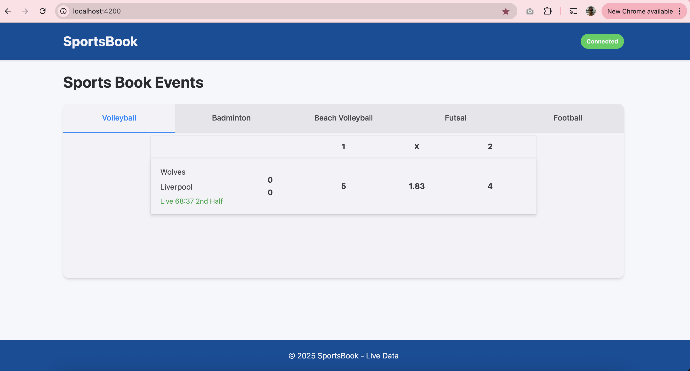
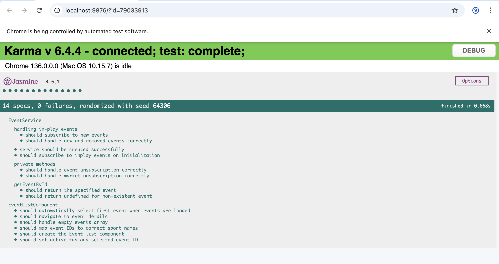

# Sportsbook

Sample to display sports data using Websocket connection

## To Initialize project please run below commands

yarn install
or
npm install

## And to run the project please run below commands

yarn start
or
npm start

## To run Tests please run below commands

yarn test
or
npm test

### Screenshots

Added in screenshots folder

 

 

### Notes

1. I have added Unit tests for Service and event-list components just to give an idea of the knowledge.
2. I have assumed the Team names and added as tab titles
3. Know issue - After events subscriptions to receive the events data , it takes some time to render on the component view. This can be fixed by using Store module.
